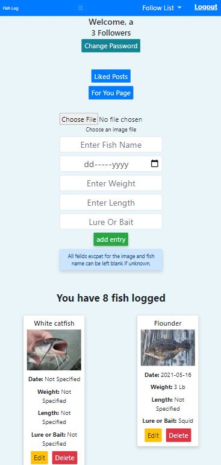

# Fishing-Log
 A 
 Flask app with a database that allows users to create a profile and log catches to their profile. Users can also view other's profiles using the lookup fuctionality.
This will lead the user to a view similar to their own homepage but the ability to insert or remove logs is not present.
##  Screenshots
 
 ### Login Page

### Homepage on mobile devices

### Profile page on mobile devices

## Demos

### Homepage

### Profile

