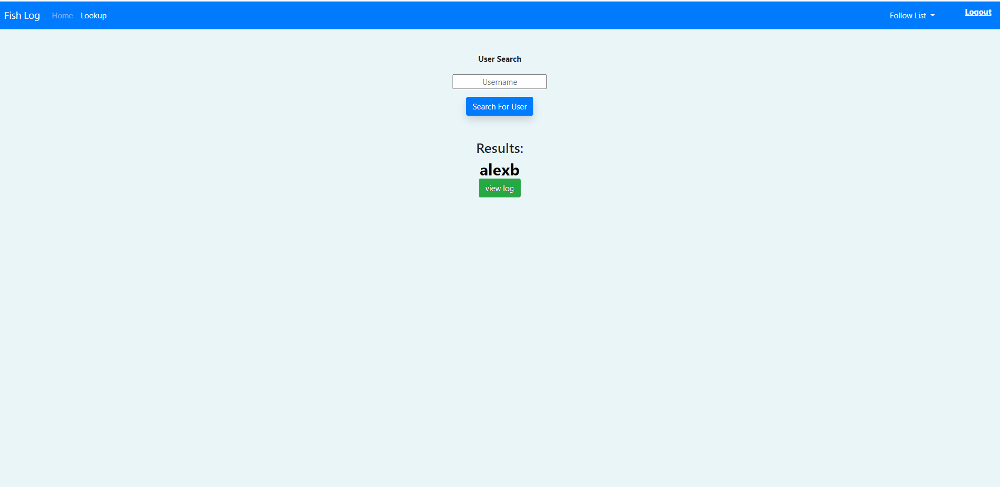

# Fishing-Log
This Flask app includes a SQLite database, letting users easily make profiles to keep track of their catches. Users can edit catch details later to add more info. It also has a search function for checking out other profiles, following them, and liking posts. Plus, there's a Latest page to see the newest posts from other users on the platform.

# Deployment:
https://maurerja2000.pythonanywhere.com/login

##  Screenshots
 
 ### Login Page

 ### Latest Page

 ### Liked Page

### Latest Page Mobile View

### Liked Post Page Mobile View

### Homepage Mobile View

### Edit Mobile View

### Profile page Mobile View

## Demos

### Homepage

### Lookup and Profile

